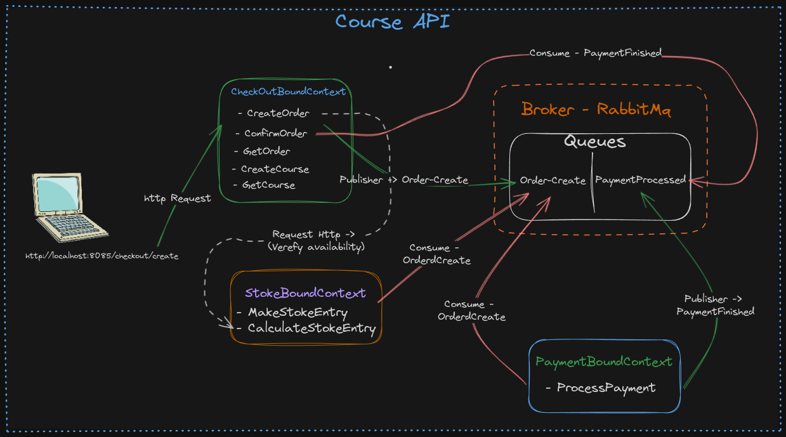

# Course API


This project is an API built using **Java, Java Spring, jpa, PostgresSQL as the database, RabbitMq, Junit For Testing.**

The API was development by me to practice asynchronous communication between microservices using RabbitMq ("In this case i create the whole application in the same code base but the BoundContext of each application is separated within courseapi/application/usecases").



## Table of Contents

- [Installation / Docker](#installation)
- [Configuration](#configuration)
- [Docker](#docker)
- [Test](#test)
- [Usage](#usage)
- [API Endpoints](#api-endpoints)
- [Contributing](#contributing)

## Installation / Docker

1. Clone the repository:

```bash
git clone https://github.com/LeandroSantosP/courseCheckout.git
```

2. Install dependencies with Maven

3. Install [PostgresSQL](https://www.postgresql.org/)

4. Install RabbitMq [RabbitMq](https://rabbitmq.com/)

   **Recommend Exec With Docker/Docker-compose ([Docker](https://www.docker.com/))**

   ```bash
   bash ./docker/run-docker.sh
   ```

## Configuration

Create an application.properties file in resources folder with your postgres credentials:

spring.datasource.url="YOUR_DATABASE_URL"
spring.datasource.username="YOUR_USER_NAME"
spring.datasource.password="YOUR_PASSWORD"

spring.rabbitmq.username="YOUR_USERNAME"
spring.rabbitmq.password="YOU_PASSWORD"

RabbitMq and Postgres credentials are set on application.properties and docker-compose.yaml,
you can change if you wanna changer you can do it.

Check applicationExample.properties file.

## Test

To run the tests, Follow the next steps (Make sure the Configuration is Already done):

1. Run The Application for integration test can running.

   ```bash
   mvn spring-boot:run
   ```

2. Open a side terminal and run the suit of tests cases by execution the following codes:

   ```bash
   mvn test

   mvn -Dtest=TestFileName test
   ```

## Usage

1. Start the application with Maven
2. The API will be accessible at http://localhost:8085

## API Endpoints

**Go into ./docs and see api.http file or import the insomnia file into the insonia**

POST http://localhost:8085/course/

POST http://localhost:8085/stoke-entry/create

Body-json:

```json
{
  "courseId": "{{courseId}}",
  "operation": "in",
  "amount": 10
}
```

POST http://localhost:8085/stoke-entry/calculate/{{courseId}}

POST http://localhost:8085/checkout/create

Body-json:

```json
{
  "courseId": "{{courseId}}",
  "name": "Java Course",
  "email": "john.doe@gmail.com",
  "creditCardToken": "12345"
}
```

GET http://localhost:8085/checkout/{{orderId}}

To see body/params request go to api.http or insonia

## Contributing

Contributions are welcome! If you find any issues or have suggestions for improvements, please open an issue or submit a pull request to the repository.

When contributing to this project, please follow the existing code style, [commit conventions](https://www.conventionalcommits.org/en/v1.0.0/), and submit your changes in a separate branch.
